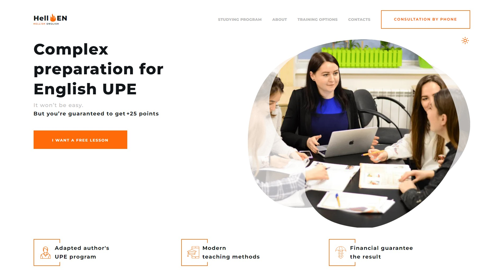

## Project "Hellen"

### The project is based on Parcel.

### Using Vanilla Javascript, SCSS, HTML.

### Project created by:

- [**Team Lead:** Maksym Pokulytyi](https://github.com/Maxwelllife)
- [**Scrum master** & **Front-end developer**: Oksana Brunko](https://github.com/SXuha)
- [**Front-end developer**: Gnatyk Oleg](https://github.com/GnatykOleg)
- [**Front-end developer**: Aleksandr Katsinskiy](https://github.com/Katsinskiy)
- [**Front-end developer**: Anatolii-Vasiuk](https://github.com/Anatolii-Vasiuk)
- [**Front-end developer**: Vlad Shchelkunov](https://github.com/Specter-ode)

## Tasks

#### - Develop a website of Complex preparation for English UPE;

#### - Adaptive layout for three breakpoints 320px, 768px, 1680px

#### - Develop arrow to top.

#### - Develop website themes: day/night;

